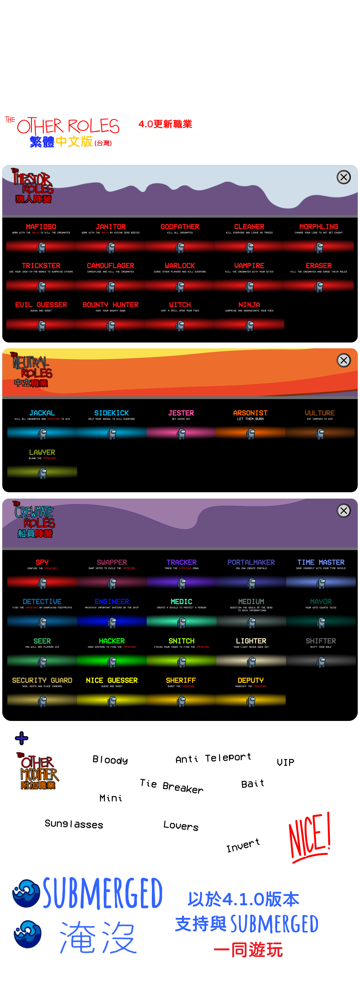

This mod is not affiliated with Among Us or Innersloth LLC, and the content contained therein is not endorsed or otherwise sponsored by Innersloth LLC. Portions of the materials contained herein are property of Innersloth LLC. © Innersloth LLC.

本人第一次在github發東西 若有不好請見諒 本儲藏庫頁面是由[The Other Roles](https://github.com/Eisbison/TheOtherRoles)的模板修改而成

# The Other Roles

The **The Other Roles**, is a mod for [Among Us](https://store.steampowered.com/app/945360/Among_Us) which adds many new roles, new [Settings](#settings) and new [Custom Hats](#custom-hats) to the game.
Even more roles are coming soon. :)

| 偽裝者 | 船員 | 中立 | 附加職業 |
|----------|-------------|-----------------|----------------|
| [教父(黑手黨)](#mafia) | [小偷](#shifter) | [小丑](#jester) | [血族人](#bloody) |
| [小弟 (黑手黨)](#mafia) | [市長](#mayor) | [Arsonist](#arsonist) | [反傳送](#anti-teleport) |
| [看門人 (黑手黨)](#mafia)|[工程師](#engineer) | [豺狼](#jackal) | [決勝者](#tie-breaker) |
| [變身精靈](#morphling) | [警長](#sheriff) | [跟班](#sidekick) | [誘餌](#bait) |
| [隱藏者](#camouflager) | [Deputy](#deputy) | [禿鷲](#vulture) | [戀人](#lovers) |
| [吸血鬼](#vampire) | [執燈人](#lighter) | [律師](#lawyer) | [墨鏡](#sunglasses) |
| [抹除者](#eraser) | [偵探](#detective) | | [迷你船員](#mini) |
| [騙術師](#trickster) | [時間之主](#time-master) | | [VIP](#vip) |
| [清理者](#cleaner) | [軍醫](#medic) |  | [相反移動者](#invert) |
| [詛咒者](#warlock) | [換票師](#swapper) |
| [賞金獵人](#bounty-hunter) | [預言家](#seer) |  |
| [巫師](#witch) | [駭客](#hacker) |  |  |
| [忍者](#ninja) | [追蹤者](#tracker) |  |  |
| [邪惡賭徒](#guesser) | [告密者](#snitch) |  |  |
|  | [間諜](#spy) |  |  |
|  | [傳送者](#portalmaker) |  |  |
|  | [警衛](#security-guard) |  |  |
|  | [靈媒](#medium) |  |  |
|  | [正義賭徒](#guesser) |  |

# Releases
| Among Us - 版本| 模組版本 | 連結 |
|----------|-------------|-----------------|
| 2022.3.29| v4.1.4| [Download](https://github.com/Eisbison/TheOtherRoles/releases/download/v4.1.4/TheOtherRoles.zip)
|----------|在414之前的版本去找蟑龍牌漢化，此版本為蟑龍漢化的分支，採取更官方式的翻譯(雖然沒差多少)| [link](https://forum.gamer.com.tw/C.php?bsn=39247&snA=444&last=1#down)|
| 2022.3.29| v4.1.3| [Download](https://forum.gamer.com.tw/C.php?bsn=39247&snA=444&last=1#down)
| 2022.3.29| v4.1.2| [Download](https://forum.gamer.com.tw/C.php?bsn=39247&snA=444&last=1#down)
| 2022.3.29| v4.1.1| [Download](https://forum.gamer.com.tw/C.php?bsn=39247&snA=444&last=1#down)
| 2022.3.29| v4.1.0| [Download](https://forum.gamer.com.tw/C.php?bsn=39247&snA=444&last=1#down)
| 2022.3.29s| v4.0.0| [Download](https://forum.gamer.com.tw/C.php?bsn=39247&snA=444&last=1#down)
| 2022.3.29s| v3.4.5| [Download](https://forum.gamer.com.tw/C.php?bsn=39247&snA=444&last=1#down)
| 2022.2.23s| v3.4.4| [Download](https://forum.gamer.com.tw/C.php?bsn=39247&snA=444&last=1#down)
| 2021.12.15s| v3.4.3| [Download](https://forum.gamer.com.tw/C.php?bsn=39247&snA=444&last=1#down)
|------------| 343之前的版本都沒漢化 |----------|
| 2021.12.15s| v3.4.2| [Download](https://github.com/Eisbison/TheOtherRoles/releases/download/v3.4.2/TheOtherRoles.zip)
| 2021.12.15s| v3.4.1| [Download](https://github.com/Eisbison/TheOtherRoles/releases/download/v3.4.1/TheOtherRoles.zip)
| 2021.12.15s| v3.4.0| [Download](https://github.com/Eisbison/TheOtherRoles/releases/download/v3.4.0/TheOtherRoles.zip)
| 2021.12.15s| v3.3.3| [Download](https://github.com/Eisbison/TheOtherRoles/releases/download/v3.3.3/TheOtherRoles.zip)
| 2021.12.15s| v3.3.2| [Download](https://github.com/Eisbison/TheOtherRoles/releases/download/v3.3.2/TheOtherRoles.zip)
| 2021.12.14s| v3.3.1| [Download](https://github.com/Eisbison/TheOtherRoles/releases/download/v3.3.1/TheOtherRoles.zip)
| 2021.12.14s| v3.3.0| [Download](https://github.com/Eisbison/TheOtherRoles/releases/download/v3.3.0/TheOtherRoles.zip)
| 2021.11.9.5s| v3.2.4| [Download](https://github.com/Eisbison/TheOtherRoles/releases/download/v3.2.4/TheOtherRoles.zip)
| 2021.11.9.5s| v3.2.3| [Download](https://github.com/Eisbison/TheOtherRoles/releases/download/v3.2.3/TheOtherRoles.zip)
| 2021.11.9.5s| v3.2.2| [Download](https://github.com/Eisbison/TheOtherRoles/releases/download/v3.2.2/TheOtherRoles.zip)
| 2021.11.9.5s| v3.2.1| [Download](https://github.com/Eisbison/TheOtherRoles/releases/download/v3.2.1/TheOtherRoles.zip)
| 2021.11.9.5s| v3.2.0| [Download](https://github.com/Eisbison/TheOtherRoles/releases/download/v3.2.0/TheOtherRoles.zip)
| 2021.11.9.5s| v3.1.2| [Download](https://github.com/Eisbison/TheOtherRoles/releases/download/v3.1.2/TheOtherRoles.zip)
| 2021.11.9.5s| v3.1.1| [Download](https://github.com/Eisbison/TheOtherRoles/releases/download/v3.1.1/TheOtherRoles.zip)
| 2021.11.9.5s| v3.1.0| [Download](https://github.com/Eisbison/TheOtherRoles/releases/download/v3.1.0/TheOtherRoles.zip)
| 2021.11.9.5s| v3.0.0| [Download](https://github.com/Eisbison/TheOtherRoles/releases/download/v3.0.0/TheOtherRoles.zip)
| 2021.6.30s| v2.9.2| [Download](https://github.com/Eisbison/TheOtherRoles/releases/download/v2.9.2/TheOtherRoles.zip)
| 2021.6.30s| v2.9.1| [Download](https://github.com/Eisbison/TheOtherRoles/releases/download/v2.9.1/TheOtherRoles.zip)
| 2021.6.30s| v2.9.0| [Download](https://github.com/Eisbison/TheOtherRoles/releases/download/v2.9.0/TheOtherRoles.zip)
| 2021.6.30s| v2.8.1| [Download](https://github.com/Eisbison/TheOtherRoles/releases/download/v2.8.1/TheOtherRoles.zip)
| 2021.6.30s| v2.8.0| [Download](https://github.com/Eisbison/TheOtherRoles/releases/download/v2.8.0/TheOtherRoles.zip)
| 2021.6.30s| v2.7.3| [Download](https://github.com/Eisbison/TheOtherRoles/releases/download/v2.7.3/TheOtherRoles.zip)
| 2021.6.15s| v2.7.1| [Download](https://github.com/Eisbison/TheOtherRoles/releases/download/v2.7.1/TheOtherRoles.zip)
| 2021.6.15s| v2.7.0| [Download](https://github.com/Eisbison/TheOtherRoles/releases/download/v2.7.0/TheOtherRoles.zip)
| 2021.5.25.2s| v2.6.7| [Download](https://github.com/Eisbison/TheOtherRoles/releases/download/v2.6.7/TheOtherRoles.zip)
| 2021.5.10s| v2.6.6| [Download](https://github.com/Eisbison/TheOtherRoles/releases/download/v2.6.6/TheOtherRoles.zip)
| 2021.5.10s| v2.6.5| [Download](https://github.com/Eisbison/TheOtherRoles/releases/download/v2.6.5/TheOtherRoles.zip)
| 2021.5.10s| v2.6.4| [Download](https://github.com/Eisbison/TheOtherRoles/releases/download/v2.6.4/TheOtherRoles.zip)
| 2021.5.10s| v2.6.3| [Download](https://github.com/Eisbison/TheOtherRoles/releases/download/v2.6.3/TheOtherRoles.zip)
| 2021.5.10s| v2.6.2| [Download](https://github.com/Eisbison/TheOtherRoles/releases/download/v2.6.2/TheOtherRoles.zip)
| 2021.4.14s| v2.6.1| [Download](https://github.com/Eisbison/TheOtherRoles/releases/download/v2.6.1/TheOtherRoles.zip)
| 2021.4.14s| v2.6.0| [Download](https://github.com/Eisbison/TheOtherRoles/releases/download/v2.6.0/TheOtherRoles.zip)
| 2021.4.14s| v2.5.1| [Download](https://github.com/Eisbison/TheOtherRoles/releases/download/v2.5.1/TheOtherRoles.zip)
| 2021.4.14s| v2.5.0| [Download](https://github.com/Eisbison/TheOtherRoles/releases/download/v2.5.0/TheOtherRoles.zip)
| 2021.4.14s| v2.4.0| [Download](https://github.com/Eisbison/TheOtherRoles/releases/download/v2.4.0/TheOtherRoles.zip)
| 2021.4.14s| v2.3.0| [Download](https://github.com/Eisbison/TheOtherRoles/releases/download/v2.3.0/TheOtherRoles.zip)
| 2021.4.14s| v2.2.2| [Download](https://github.com/Eisbison/TheOtherRoles/releases/download/v2.2.2/TheOtherRoles.zip)
| 2021.4.12s| v2.2.1| [Download](https://github.com/Eisbison/TheOtherRoles/releases/download/v2.2.1/TheOtherRoles.zip)
| 2021.4.12s| v2.2.0| [Download](https://github.com/Eisbison/TheOtherRoles/releases/download/v2.2.0/TheOtherRoles.zip)
| 2021.3.31.3s| v2.1.0| [Download](https://github.com/Eisbison/TheOtherRoles/releases/download/v2.1.0/TheOtherRoles.zip)
| 2021.3.31.3s| v2.0.1 beta| [Download](https://github.com/Eisbison/TheOtherRoles/releases/download/v2.0.1/TheOtherRoles.zip)
| 2021.3.31.3s | v2.0.0 beta | [Download](https://github.com/Eisbison/TheOtherRoles/releases/download/v2.0.0/TheOtherRoles.zip)
| 2021.3.5s | v1.8.2 | [Download](https://github.com/Eisbison/TheOtherRoles/releases/download/v1.8.2/TheOtherRoles.zip)
| 2021.3.5s | v1.8.1 | [Download](https://github.com/Eisbison/TheOtherRoles/releases/download/v1.8.1/TheOtherRoles.zip)
| 2021.3.5s | v1.8 | [Download](https://github.com/Eisbison/TheOtherRoles/releases/download/v1.8/TheOtherRoles.zip)
| 2021.3.5s | v1.7 | [Download](https://github.com/Eisbison/TheOtherRoles/releases/download/v1.7/TheOtherRoles.zip)
| 2021.3.5s | v1.6 | [Download](https://github.com/Eisbison/TheOtherRoles/releases/download/v1.6/TheOtherRoles.zip)
| 2021.3.5s | v1.5 | [Download](https://github.com/Eisbison/TheOtherRoles/releases/download/v1.5/TheOtherRoles.zip)
| 2021.3.5s | v1.4 | [Download](https://github.com/Eisbison/TheOtherRoles/releases/download/v1.4/TheOtherRoles.zip)
| 2021.3.5s | v1.3 | [Download](https://github.com/Eisbison/TheOtherRoles/releases/download/v1.3/TheOtherRoles.zip)
| 2020.12.19s | v1.1 | [Download](https://github.com/Eisbison/TheOtherRoles/releases/download/v1.1/TheOtherRoles.zip)
| 2020.12.19s | v1.0 | [Download](https://github.com/Eisbison/TheOtherRoles/files/6097191/TheOtherRoles.zip)

  
